"IEEE is the world's largest engineering organization, and UH is a pretty big school. We should be a stronger student chapter."

My motivation for being a part of IEEE-UH is to build a beacon for students interested in engineering, from aspiring researchers, competitive hobbyists, and novices.

I have more to say about my experience but I'll add all of that later.

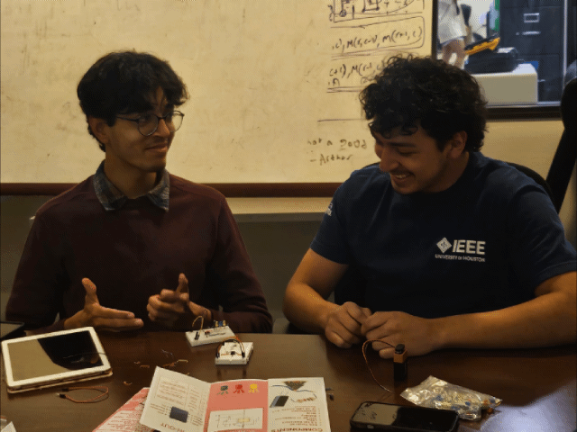
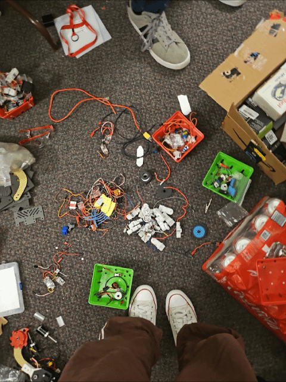
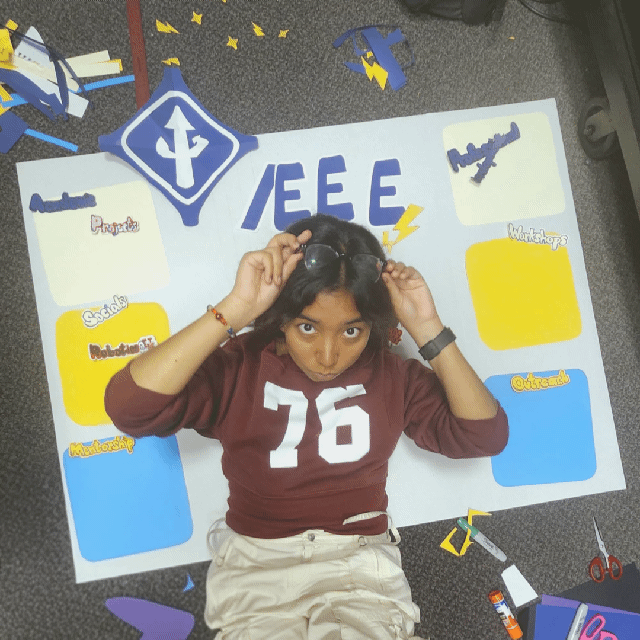
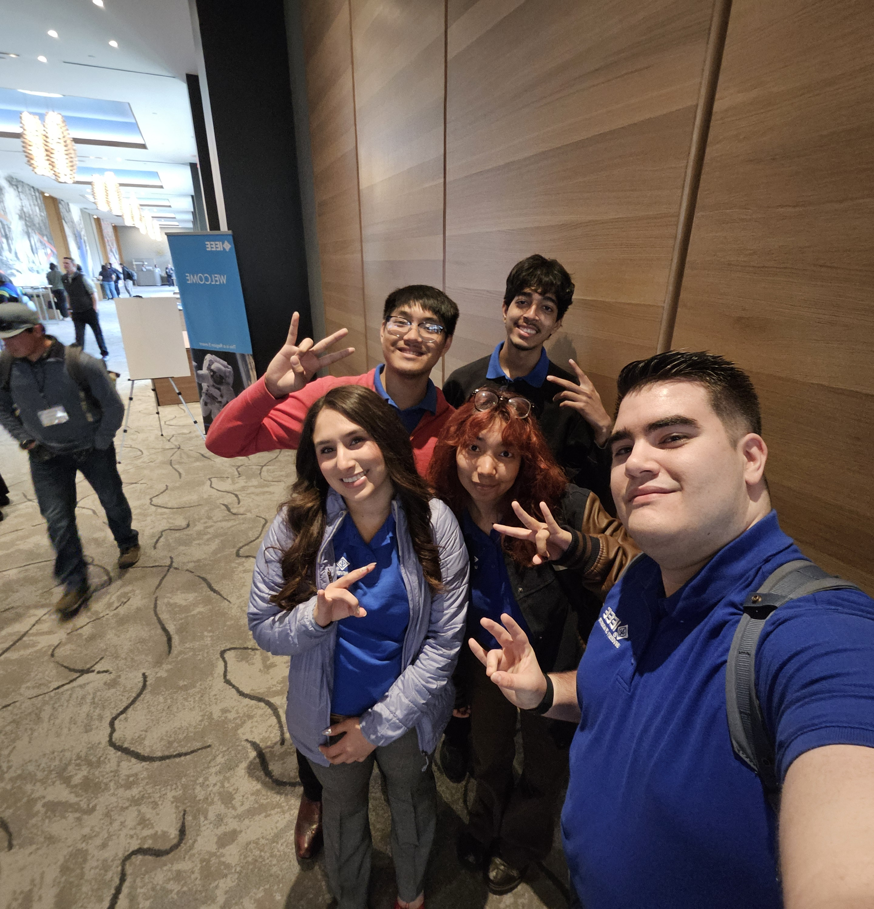

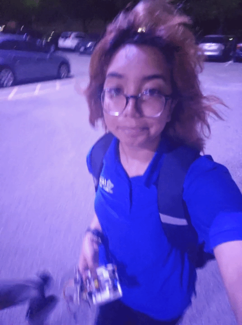
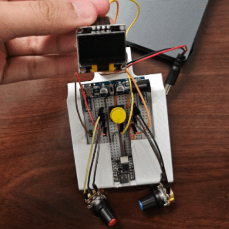
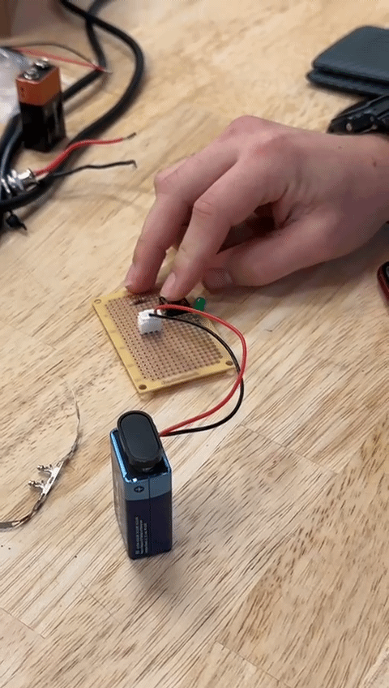
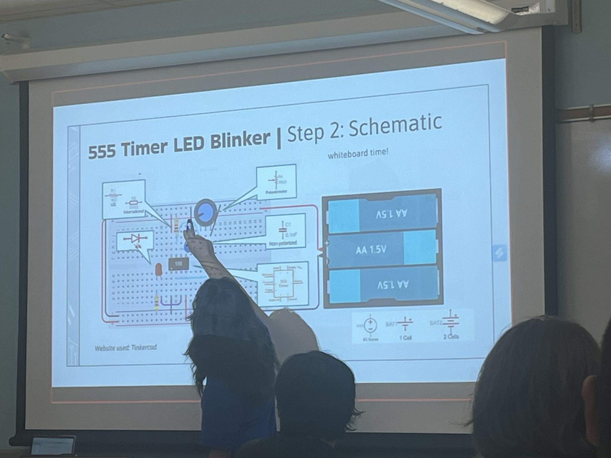
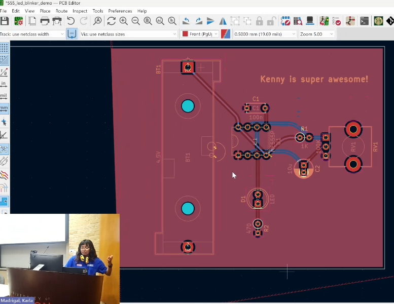
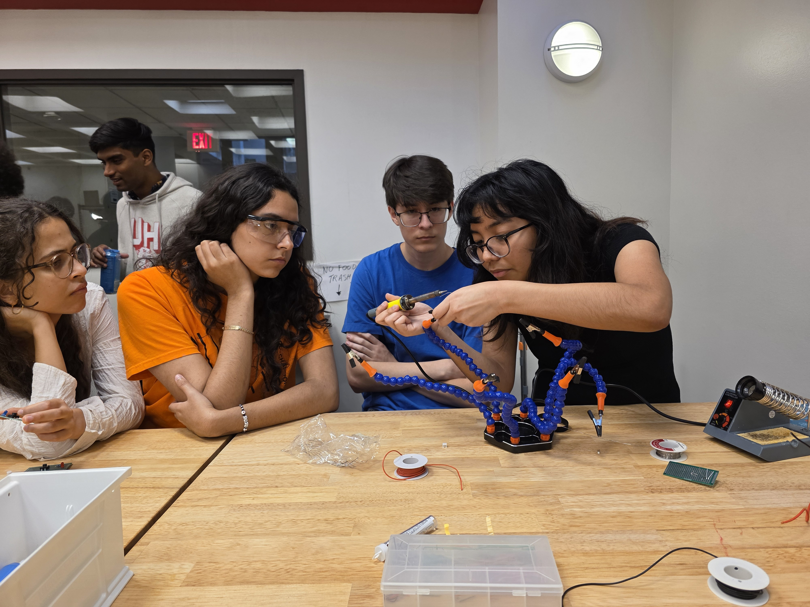
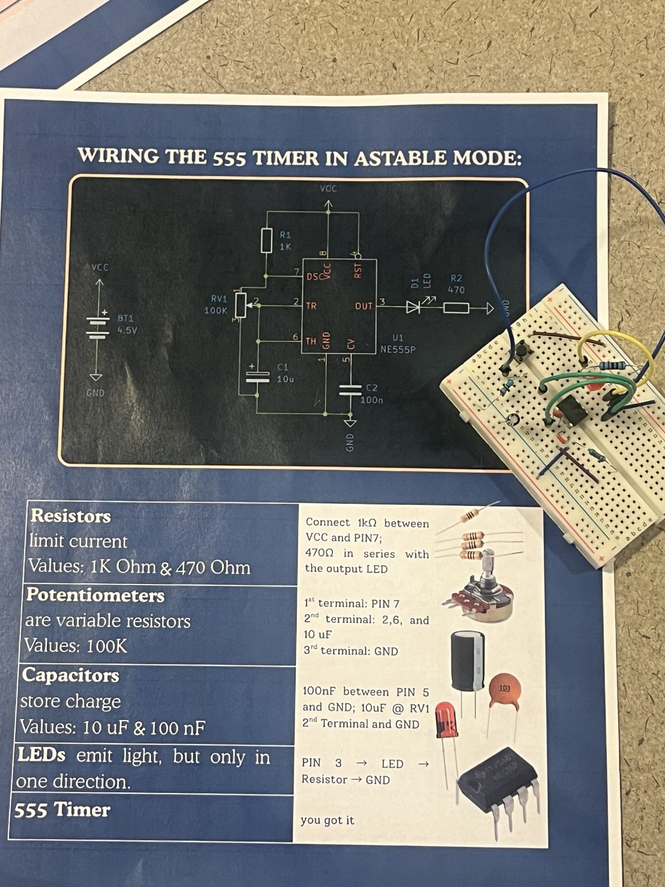
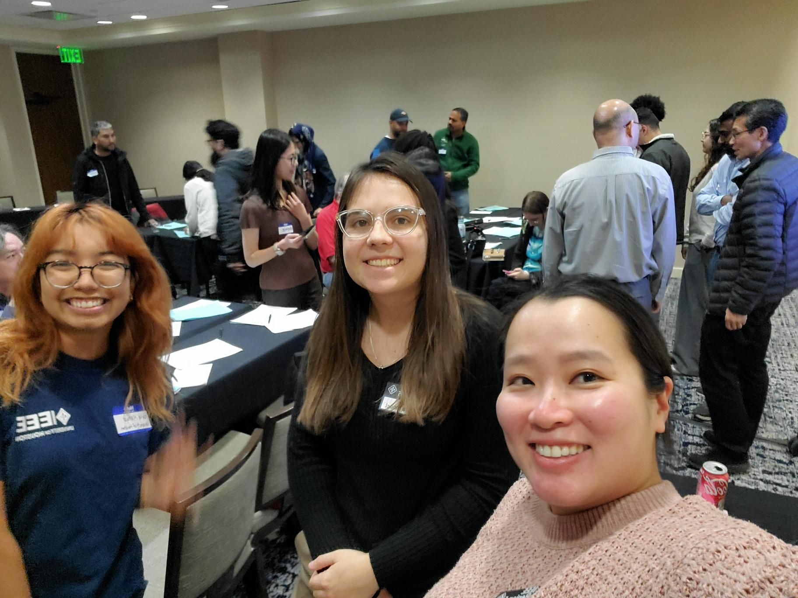
