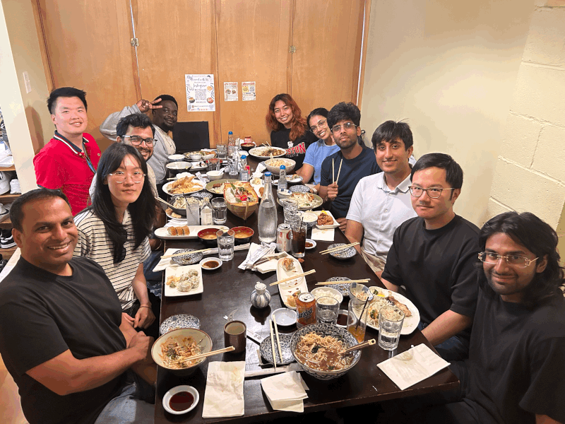
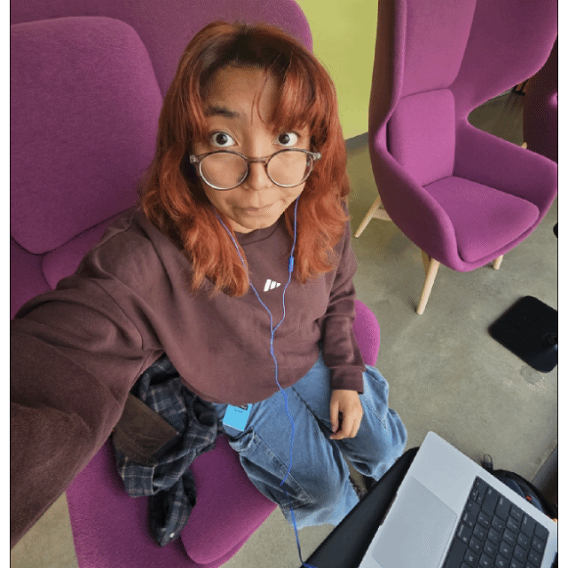
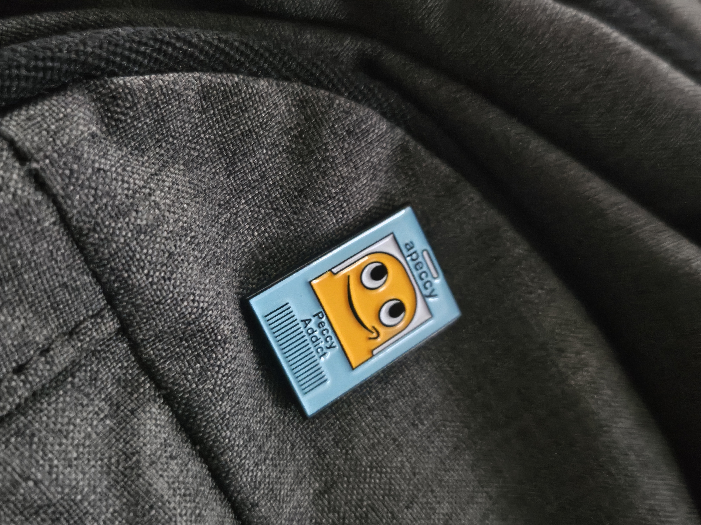

My second Amazon software engineering internship was with SCOT during Summer 2026. I designed and implemented a data ingestion to agent diagnostics pipeline to investigate anomalies in Amazon Crossdock routes.

My mentor challenged my assumptions and inspired me to focus more on the outcomes and less on technical nittygritty.

