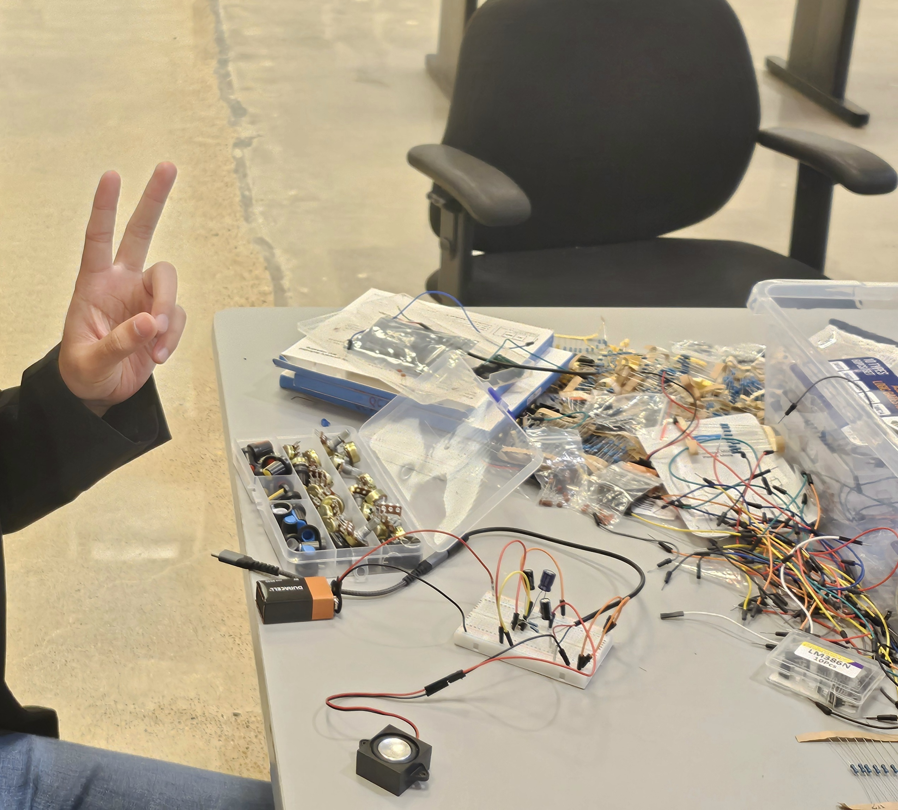

I help keep the CREATE-UH program running smoothly while supporting students through practical hardware work. I am a Hardware Design Lab Assistant for the 2025-2026 and 2026-2027 academic years, and I am now the senior lab assistant for the new ECE-focused lab.

I hosted the first soldering workshop in the program's history. When students need help understanding a circuit, debugging a connection, or getting comfortable with soldering, I am often one of the people they come to first.

